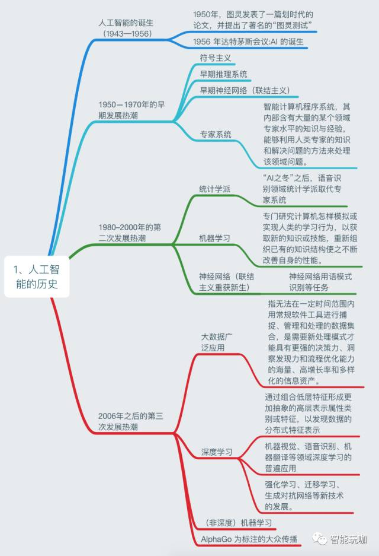
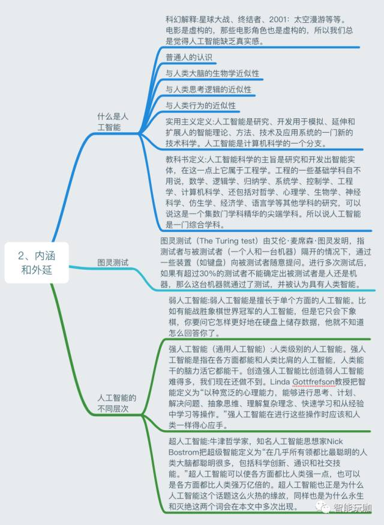
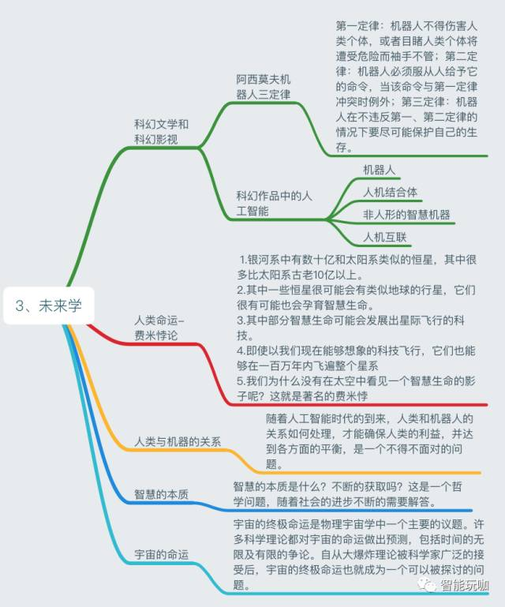
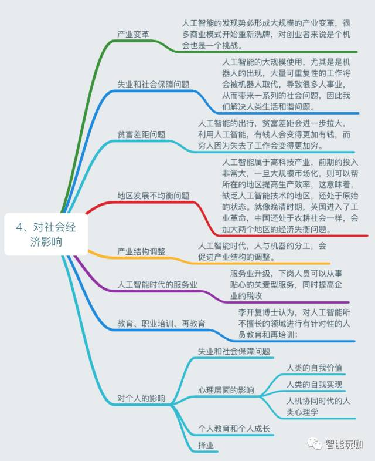
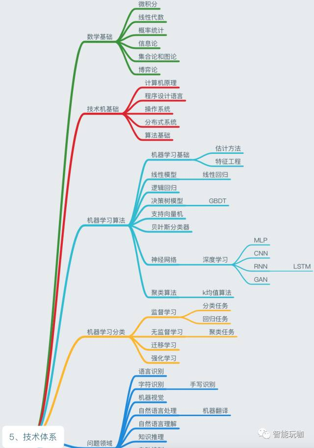
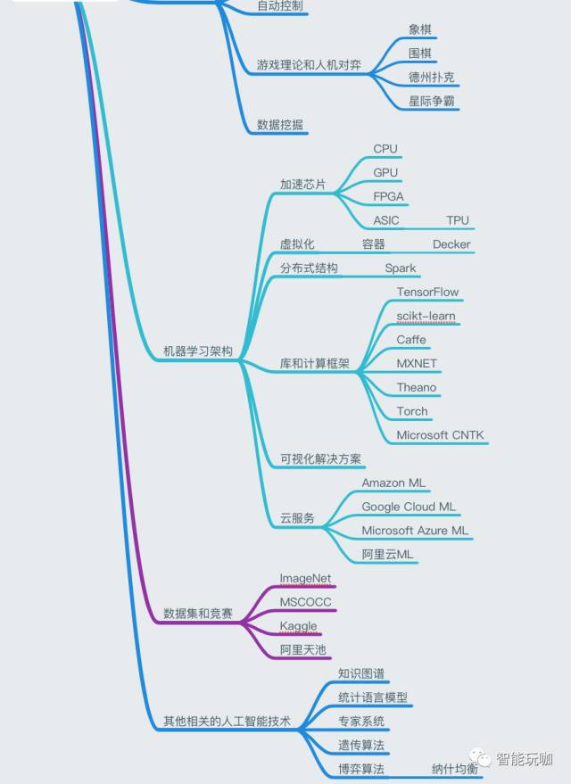
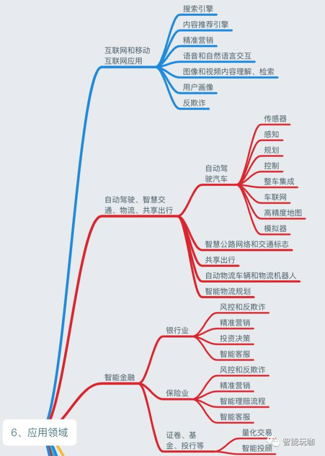
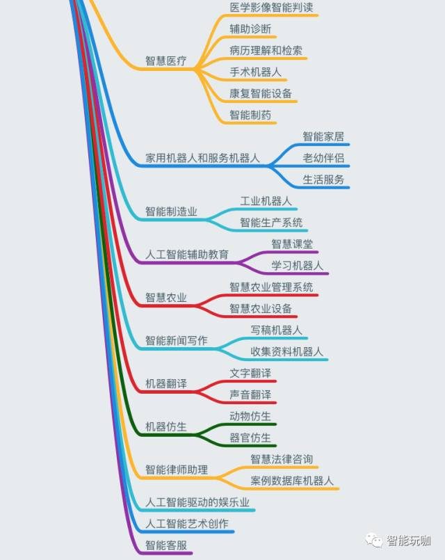

#  我的人工智能自学计划
 - AUTHOR: xinzhiniepan
 - DATE: 2018-03-24 10:26

##  学习计划表(作息时间)
> 6:00\~7:30  英语学习 
> 8:00\~12:00 java学习 
> 12:00\~15:00 学习和复习java 
> 15:30\~16:00 午休 
> 16:00\~17:00 代码练习 
> 17:00\~21:00 人工智能学习以及学习数据库 
> 21:00\~23:00     感受自然 
> 23:00\~00:00     拥抱世界 
PS:每天至少花两个小时来学习相关知识

## 学习路线

## 人工智能知识大全

